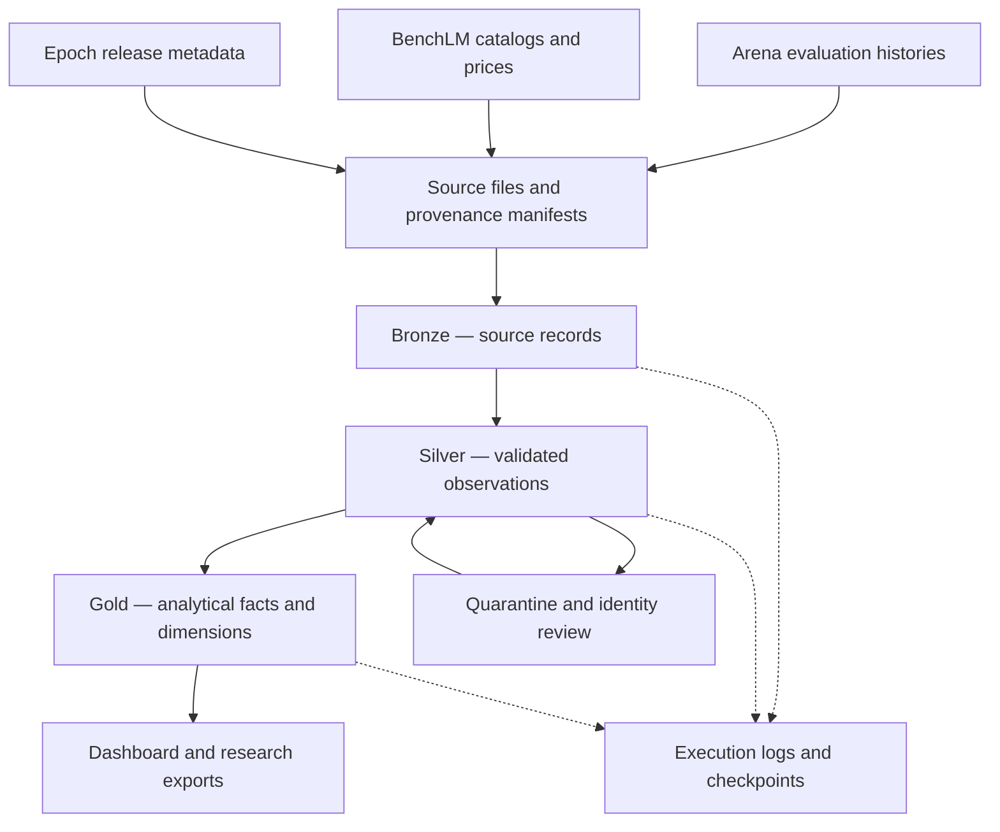

<div align="center">


<br />

<a href="#the-observatory"></a>
<a href="#lakehouse-design"></a>
<a href="#project-status"></a>
<a href="LICENSE"></a>

<br /><br />

<a href="https://spark.apache.org/"></a>
<a href="https://www.python.org/"></a>
<a href="https://delta.io/"></a>
<a href="https://www.databricks.com/"></a>


<br /><br />

**Published evaluations. Traceable observations. Workload-specific comparisons.**

[Explore](#the-observatory) · [Architecture](#lakehouse-design) · [Sources](#data-sources) · [Research](#research-direction) · [Product roadmap](#product-direction) · [Proposal](proposals/Phase-1-Proposal.docx)

</div>

---

## The observatory

Frontier AI Observatory is a data platform for examining how published AI evaluations, model releases, and API prices change over time. It is designed to help developers compare candidate models and give researchers a reproducible record of the evidence behind those comparisons.

The proposed pipeline brings public data into an Apache Spark lakehouse. Bronze preserves source records, Silver validates their meaning and identity, and Gold organizes them for dashboards and analysis. Every comparison should remain traceable to its source, publication date, and model configuration.

<table>
<tr>
<td width="33%" align="center"><strong>◈ CAPABILITY</strong><br /><br />Compare results within compatible benchmarks and evaluation methods.</td>
<td width="33%" align="center"><strong>◇ COST</strong><br /><br />Estimate token expenditure for a stated workload and deployment mode.</td>
<td width="33%" align="center"><strong>◎ EVIDENCE</strong><br /><br />Inspect provenance, missing data, identity matches, and source freshness.</td>
</tr>
</table>

## Project status

**Foundation stage.** The source pilot, representative historical and subsequent dated samples, proposal, and schema design examples are prepared. The cloud pipeline, scheduled ingestion, Gold tables, and dashboard remain planned implementation work. Technology badges describe the intended stack.

| Initial source pilot | Measured result |
| :--- | ---: |
| Selected Arena historical observations | 1,042,667 rows |
| Combined selected source downloads | 62.48 MB |
| Subsequent dated Arena sample batch | 11,431 rows |
| Source review date | 1 October 2026 |

Measurements describe the initial downloaded files, not live repository statistics. Sizes use decimal MB. The full-load samples are representative extracts; the complete baseline is larger.

## Questions worth answering

- Which eligible models offer a better score and lower estimated cost for a selected workload?
- How has the leading published result changed within a comparable evaluation series?
- How sensitive is a shortlist to missing prices, uncertain model identity, or a different token workload?
- Which models lack enough evidence for a defensible comparison?
- How do release cadence and observed price changes affect the set of qualifying alternatives?

## Lakehouse design



| Layer | Proposed contents | Main responsibility |
| :--- | :--- | :--- |
| **Bronze** | Source payloads, revisions, checksums, ingestion timestamps | Preserve the original observation and its lineage |
| **Silver** | Model identities, evaluation observations, benchmark definitions, pricing and release records | Enforce types, validate keys, review aliases, and separate incompatible metrics |
| **Gold** | Evaluation and price facts, workload scenarios, frontier histories, release summaries, coverage metrics | Serve reproducible analysis and dashboard queries |
| **Operations** | File inventory, execution logs, checkpoints, rejected records | Explain what ran, what changed, and what requires review |

<details>
<summary><strong>Engineering principles</strong></summary>

<br />

- Explicit Spark schemas rather than inferred input contracts.
- Conditional Delta `MERGE` operations that leave unchanged records and timestamps untouched.
- Parameterized historical loads, incremental runs, and backfills.
- Schema checks and quarantine before incompatible data reaches analytical tables.
- Audit entries for processed files and tables, including no-op runs and failures.
- Reviewed model mappings that preserve versions, reasoning settings, harnesses, and deployment modes.
- Date-aware joins that use historical price observations without borrowing current prices for earlier periods.

These are implementation targets. Cloud execution evidence will be added as the pipeline is built.

</details>

## Data sources

| Source | Initial load | Incremental approach | Reuse conditions |
| :--- | :--- | :--- | :--- |
| [Arena leaderboard dataset](https://huggingface.co/datasets/lmarena-ai/leaderboard-dataset) | Selected full text, web development, and agent histories | Daily revision checks and latest publications; weekly historical reconciliation | Dataset labeled **CC BY 4.0**; attribution required |
| [BenchLM exports](https://benchlm.ai/data) | Model, benchmark, and pricing JSON catalogs | Compare complete snapshots and source build timestamps | **CC BY-NC 4.0**; commercial reuse requires an appropriate license or replacement source |
| [Epoch AI models](https://epoch.ai/data/ai-models) | Historical model metadata CSV | Daily snapshot comparison | Attribution required; author and contact fields need privacy review |

<details>
<summary><strong>Exact acquisition endpoints</strong></summary>

<br />

**Arena**

- Dataset metadata: https://huggingface.co/api/datasets/lmarena-ai/leaderboard-dataset
- Resolve files against an immutable revision returned by the API.
- Selected subsets: `text_style_control`, `webdev`, and `agent`.
- Splits: `full` for history and `latest` for current publications.

**BenchLM**

- https://benchlm.ai/data/models.json
- https://benchlm.ai/data/benchmarks.json
- https://benchlm.ai/data/pricing.json

**Epoch AI**

- https://epoch.ai/data/all_ai_models.csv
- [Refresh documentation](https://epoch.ai/data/ai-models-documentation/database-updates)

</details>

Price history starts with collected observations where a source does not supply historical tariffs. A daily polling schedule does not imply daily changes. Missing records will only be marked unavailable after complete, successful snapshots confirm their absence; earlier observations remain available.

**Optional extensions:** SWE-bench experiment artifacts for task-level coding analysis and targeted Hugging Face metadata for identity enrichment, subject to artifact-specific access and license checks. The archived Open LLM Leaderboard is historical context only. Artificial Analysis and OpenRouter are outside the required public sample portfolio because current access conditions do not establish the redistribution rights needed here.

## Dashboard direction

<table>
<tr><td><strong>01 · Capability and estimated cost</strong><br /><br />A scatterplot of a compatible evaluation score against estimated workload cost, highlighting non-dominated alternatives.</td></tr>
<tr><td><strong>02 · Published frontier over time</strong><br /><br />A timeline of leading results within a comparable series, with methodology changes and observation coverage visible.</td></tr>
<tr><td><strong>03 · Evidence coverage</strong><br /><br />A matrix of usable results, reviewed identities, provenance, and matched prices, supported by freshness and completeness metrics.</td></tr>
</table>

The intended BI surface is Databricks SQL, with a local dashboard over exported Gold tables as a free fallback. Cost scenarios will expose request volume, input tokens, billable output tokens, and tariffs. Unknown prices remain missing; self-hosted zero-price entries do not become free hosted API offers.

## Research direction

**How much do model-selection conclusions change when benchmark compatibility, incomplete evidence, and workload assumptions are taken seriously?**

The proposed study compares headline rankings with protocol-compatible cohorts and scenario-specific shortlists. It will measure ranking agreement, shortlist overlap, exclusions caused by missing evidence, and sensitivity to token assumptions or uncertain identity mappings.

Where task-level outcomes are available, resampling can estimate uncertainty. Aggregate confidence intervals alone do not provide task-level data. Published scores describe a selected evidence population, so results must account for coverage and selection bias.

Potential research outputs include a documented methodology, reproducible comparison notebooks, dated evidence exports, and analyses of recommendation stability. No research novelty or empirical result is claimed before the study is run.

## Product direction

The longer-term goal is a model-selection workspace for small AI teams. Public evidence provides an initial comparison layer; customer-owned evaluations and actual usage records could make recommendations relevant to a specific application.

| Product horizon | Intended capability |
| :--- | :--- |
| **Public observatory** | Source-linked comparisons, workload cost estimates, evidence coverage, and release tracking |
| **Decision workspace** | Saved workload profiles, model shortlists, comparison reports, and notifications when qualifying alternatives change |
| **Application evidence** | Private evaluation imports, observed usage costs, and comparisons tied to a customer’s own tasks |
| **Commercial service** | Hosted team workspaces and integrations after validating demand and resolving source and infrastructure licensing |

These are future goals, not available features. Commercial use would require replacing or licensing restricted source data and using infrastructure that permits commercial activity.

## Proposed repository layout

The layout below is the target organization. Folders for notebooks, dashboards, experiments, and workflows will appear as those components are implemented.

| Path | Purpose |
| :--- | :--- |
| `README.md` · `LICENSE` | Project overview and MIT license for original code |
| `assets/observatory-banner.svg` | Repository banner |
| `proposals/Phase-1-Proposal.docx` | Formal scope, source selection, samples, models, BI plan, and FinOps proposal |
| `config/` | Source registry, approved contracts, and reviewed model aliases |
| `data/samples/full/` | Inspected representative historical raw samples |
| `data/samples/incremental/` | Subsequent dated raw samples |
| `data/samples/manifest.json` | Source revisions, extraction details, counts, and checksums |
| `src/` | Collection, contracts, source adapters, and transformation modules |
| `notebooks/bronze/` · `notebooks/silver/` · `notebooks/gold/` | Planned Spark layer entry points |
| `sql/` | Merge examples and planned analytical queries |
| `dashboards/` | Planned dashboard definitions and screenshots |
| `research/` | Planned experiment notebooks, methods, and reproducible result summaries |
| `tests/` | Sample checks and planned pipeline validation |
| `docs/` | Data dictionary, execution guide, architecture, and source decisions |
| `.github/workflows/` | Planned automated repository checks |
| `THIRD_PARTY_NOTICES.md` | Data attribution and third-party license conditions |

Raw archives, credentials, restricted metadata, temporary exports, and workspace artifacts remain outside Git. The proposal link assumes the document is stored as `proposals/Phase-1-Proposal.docx`.

## Explore the foundation

The following commands apply when the foundation files from the starter package are present. They verify samples and collect data; they do not deploy the cloud pipeline.

```bash
# Install the dependency used by the sample verifier.
python -m pip install pyarrow

# Validate the supplied source samples and checksums.
python tests/verify_samples.py

# Collect the full text history and supporting catalogs.
python src/collect_sources.py --output data/raw \
  --arena-subset text_style_control --arena-split full

# Collect the latest text publication and supporting catalogs.
python src/collect_sources.py --output data/raw \
  --arena-subset text_style_control --arena-split latest
```

The collector supports `webdev` and `agent` through `--arena-subset`. Downloads may include personal metadata from Epoch and must be reviewed before sharing. Databricks access and scheduling will be configured separately after source connectivity is verified.

## Roadmap

- [x] Review source access, history, and reuse conditions.
- [x] Acquire and measure the initial source files.
- [x] Prepare representative historical and subsequent dated samples.
- [x] Document the proposed lakehouse and dashboard scope.
- [ ] Implement Bronze and Silver in the cloud workspace.
- [ ] Demonstrate replay safety, backfills, drift handling, and audit accuracy.
- [ ] Build Gold tables and the three dashboard views.
- [ ] Automate collection and publish execution evidence.
- [ ] Run the recommendation-stability study.
- [ ] Validate the product direction with prospective users.

## Resource discipline


The primary plan uses Databricks Free Edition and existing hardware. Development begins with small samples, then processes the full baseline once. Unchanged downloads are skipped, retained bytes are measured, and optional refreshes are deferred if quotas are exhausted. A 2 GB internal storage target is a planning cap, not a provider allowance.

## License and data notices

Original project code is released under the [MIT License](LICENSE). Third-party datasets keep their own licenses and attribution requirements; the code license does not relicense source data. Review `THIRD_PARTY_NOTICES.md` before redistributing data or adapting the observatory for commercial use.

---

<div align="center">


<br /><br />

[Back to the observatory](#the-observatory)

</div>
