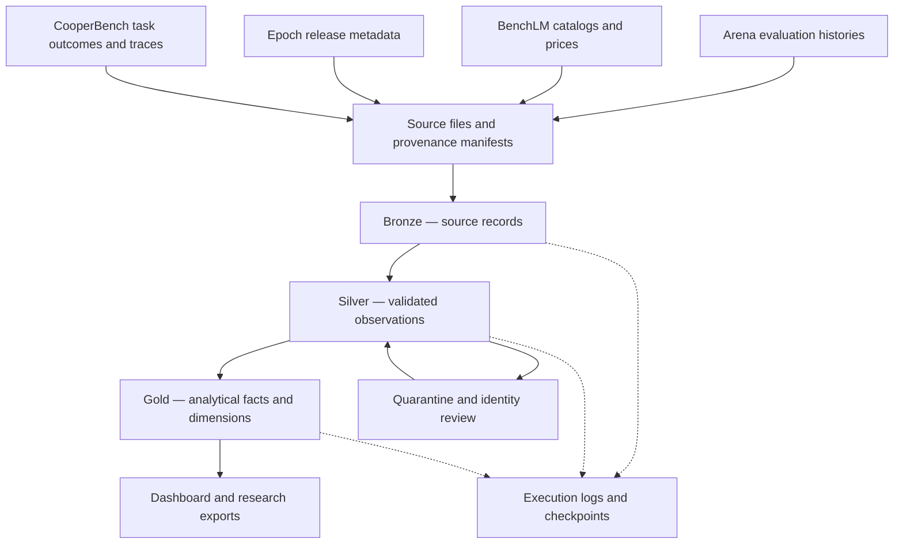

<div align="center">


<br />

<a href="#the-observatory"></a>
<a href="#lakehouse-design"></a>
<a href="#project-status"></a>
<a href="LICENSE"></a>

<br /><br />

<a href="https://spark.apache.org/"></a>
<a href="https://www.python.org/"></a>
<a href="https://delta.io/"></a>
<a href="https://www.databricks.com/"></a>


<br /><br />

**Published evaluations. Traceable observations. Workload-specific comparisons.**

[Explore](#the-observatory) · [Architecture](#lakehouse-design) · [Sources](#data-sources) · [Research](#research-direction) · [Product roadmap](#product-direction) · [Proposal](proposals/Phase-1-Proposal.docx)

</div>

---

## The observatory

Frontier AI Observatory is a data platform for examining how published AI evaluations, model releases, and API prices change over time. It is designed to help developers compare candidate models and give researchers a reproducible record of the evidence behind those comparisons.

The proposed pipeline brings public data into an Apache Spark lakehouse. Bronze preserves source records, Silver validates their meaning and identity, and Gold organizes them for dashboards and analysis. Every comparison should remain traceable to its source, publication date, and model configuration.

<table>
<tr>
<td width="33%" align="center"><strong>◈ CAPABILITY</strong><br /><br />Compare results within compatible benchmarks and evaluation methods.</td>
<td width="33%" align="center"><strong>◇ COST</strong><br /><br />Estimate token expenditure for a stated workload and deployment mode.</td>
<td width="33%" align="center"><strong>◎ EVIDENCE</strong><br /><br />Inspect provenance, missing data, identity matches, and source freshness.</td>
</tr>
</table>

## Project status

**Foundation stage.** Source inventories, verified public samples, the Phase 1 proposal, and the proposed model are available. Cloud Spark transformations, scheduled collection, Gold tables and dashboards remain planned. Technology badges describe the intended stack.

| Source inventory and samples | Measured result |
| :--- | ---: |
| Selected Arena historical observations | 2,200,800 rows |
| Core original full-load payloads | 216.37 MB |
| Initial acquisition including supplemental exports | Approximately 227 MB |
| Native subsequent Arena publication | 21,896 rows · 1.22 MB |

Sizes use decimal MB and refer to original source formats. CooperBench archives are counted compressed. Representative full-load samples do not measure the complete baseline. The native incremental files are unchanged source Parquet, with chronology and checksums recorded in the [manifest](data/samples/manifest.json).

## Questions worth answering

- Which eligible models offer a better score and lower estimated cost for a selected workload?
- How has the leading published result changed within a comparable evaluation series?
- How sensitive is a shortlist to missing prices, uncertain model identity, or a different token workload?
- Which models lack enough evidence for a defensible comparison?
- How do release cadence and observed price changes affect the set of qualifying alternatives?
- When does coding-agent coordination improve matched task outcomes, and what execution-time overhead accompanies it?

## Lakehouse design



| Layer | Proposed contents | Main responsibility |
| :--- | :--- | :--- |
| **Bronze** | Source payloads, revisions, checksums, ingestion timestamps | Preserve the original observation and its lineage |
| **Silver** | Model identities, evaluation observations, benchmark definitions, pricing, release and study-task records | Enforce types, validate keys, review aliases, and separate incompatible metrics |
| **Gold** | Evaluation and price facts, workload scenarios, frontier histories, release summaries, coverage metrics | Serve reproducible analysis and dashboard queries |
| **Operations** | File inventory, execution logs, checkpoints, rejected records | Explain what ran, what changed, and what requires review |

<details>
<summary><strong>Engineering principles</strong></summary>

<br />

- Explicit Spark schemas rather than inferred input contracts.
- Conditional Delta `MERGE` operations that leave unchanged records and timestamps untouched.
- Parameterized historical loads, incremental runs, and backfills.
- Schema checks and quarantine before incompatible data reaches analytical tables.
- Audit entries for processed files and tables, including no-op runs and failures.
- Reviewed model mappings that preserve versions, reasoning settings, harnesses, and deployment modes.
- Date-aware joins that use historical price observations without borrowing current prices for earlier periods.

These are implementation targets. Cloud execution evidence will be added as the pipeline is built.

</details>

## Data sources

| Source | Initial load | Incremental approach | Reuse conditions |
| :--- | :--- | :--- | :--- |
| [Arena leaderboard dataset](https://huggingface.co/datasets/lmarena-ai/leaderboard-dataset) | Standard and style-controlled text, web development, and agent histories | Daily revision checks and latest publications; weekly historical reconciliation | Dataset labeled **CC BY 4.0**; attribution required |
| [CooperBench study archives](https://huggingface.co/datasets/CooperBench/team-trajectories) | Four full settings: solo, shared Git, full team, and team without protocol verbs | Weekly revision checks for corrections or compatible new runs; no guaranteed daily additions | Dataset card **Apache 2.0**; inherited notices may apply; unreviewed traces stay restricted |
| [BenchLM exports](https://benchlm.ai/data) | Model, benchmark, and pricing JSON catalogs | Compare complete snapshots and source build timestamps | **CC BY-NC 4.0**; commercial reuse requires an appropriate license or replacement source |
| [Epoch AI models](https://epoch.ai/data/ai-models) | Historical model metadata CSV | Daily snapshot comparison | Attribution required; author and contact fields need privacy review |

<details>
<summary><strong>Exact acquisition endpoints</strong></summary>

<br />

**Arena**

- Dataset metadata: https://huggingface.co/api/datasets/lmarena-ai/leaderboard-dataset
- Resolve files against an immutable revision returned by the API.
- Selected subsets: `text`, `text_style_control`, `webdev`, and `agent`.
- Splits: `full` for history and `latest` for current publications.

**CooperBench**

- https://huggingface.co/datasets/CooperBench/team-trajectories
- Original `cmp-full-solo.tar.gz`, `cmp-full-coopgit.tar.gz`, `cmp-full-team.tar.gz`, and `cmp-full-team-noproto.tar.gz`.
- [Pinned URLs and original checksums](config/source-registry.json).

**BenchLM**

- https://benchlm.ai/data/models.json
- https://benchlm.ai/data/benchmarks.json
- https://benchlm.ai/data/pricing.json

**Epoch AI**

- https://epoch.ai/data/all_ai_models.csv
- [Refresh documentation](https://epoch.ai/data/ai-models-documentation/database-updates)

</details>

Price history starts with collected observations where a source does not supply historical tariffs. A daily polling schedule does not imply daily changes. Missing records will only be marked unavailable after complete, successful snapshots confirm their absence; earlier observations remain available.

CooperBench supplies a bounded study of outcomes and duration. Its source deployment alias remains separate from public pricing SKUs. Missing evaluations are disclosed, and zero-filled cost or token fields remain unmeasured. Standard and style-controlled Arena text are related evidence, not independent experiments.

**Optional extensions:** SWE-bench experiment artifacts for task-level coding analysis and targeted Hugging Face metadata for identity enrichment, subject to artifact-specific access and license checks. The archived Open LLM Leaderboard is historical context only. Artificial Analysis and OpenRouter are outside the required public sample portfolio because current access conditions do not establish the redistribution rights needed here.

## Dashboard direction

<table>
<tr><td><strong>01 · Capability and estimated cost</strong><br /><br />A scatterplot of a comparable evaluation score against workload token cost, highlighting eligible non-dominated alternatives.</td></tr>
<tr><td><strong>02 · Coding-agent coordination</strong><br /><br />Paired success-rate bars and duration distributions across four study settings, with evaluated counts, missing evaluations and merge outcomes visible.</td></tr>
<tr><td><strong>03 · Published capability over time</strong><br /><br />Leading published results within a comparable series, with methodology changes, style sensitivity and evidence coverage visible.</td></tr>
</table>

Databricks SQL is the intended BI surface, with a local dashboard over exported Gold tables as the free fallback. Token prices support workload scenarios, not measured agent-run bills. Unknown prices and deployment matches remain missing. See the [proposed architecture](docs/architecture.md).

## Research direction

**How much do model-selection conclusions change when benchmark compatibility, incomplete evidence, and workload assumptions are taken seriously?**

The proposed study compares headline rankings with protocol-compatible cohorts and scenario-specific shortlists. It will measure ranking agreement, shortlist overlap, exclusions caused by missing evidence, and sensitivity to token assumptions or uncertain identity mappings.

Where task-level outcomes are available, resampling can estimate uncertainty. Aggregate confidence intervals alone do not provide task-level data. Published scores describe a selected evidence population, so results must account for coverage and selection bias.

The CooperBench study adds a matched-task analysis of coordination outcomes and duration across four settings. Missing evaluations and the specific deployment/harness limit generalization.

Potential research outputs include a documented methodology, reproducible comparison notebooks, dated evidence exports, and analyses of recommendation stability. No research novelty or empirical result is claimed before the study is run.

## Product direction

The longer-term goal is a model-selection workspace for small AI teams. Public evidence provides an initial comparison layer; customer-owned evaluations and actual usage records could make recommendations relevant to a specific application.

| Product horizon | Intended capability |
| :--- | :--- |
| **Public observatory** | Source-linked comparisons, workload cost estimates, evidence coverage, and release tracking |
| **Decision workspace** | Saved workload profiles, model shortlists, comparison reports, and notifications when qualifying alternatives change |
| **Application evidence** | Private evaluation imports, observed usage costs, and comparisons tied to a customer’s own tasks |
| **Commercial service** | Hosted team workspaces and integrations after validating demand and resolving source and infrastructure licensing |

These are future goals, not available features. Commercial use would require replacing or licensing restricted source data and using infrastructure that permits commercial activity.

## Repository layout

| Path | Contents |
| :--- | :--- |
| `proposals/Phase-1-Proposal.docx` | Formal Phase 1 proposal |
| `config/source-registry.json` | Exact source URLs, source grains, licences and original payload inventory |
| `data/samples/full/arena/` | Four representative historical Parquet subsets |
| `data/samples/full/cooperbench/` | Four inspected native result JSON members |
| `data/samples/full/benchlm/` | Attributed catalog and pricing subsets |
| `data/samples/incremental/arena/` | Three unchanged native subsequent publication files |
| `data/samples/manifest.json` | Source sizes, revisions, selections and checksums |
| `tools/verify_samples.py` | Local sample and chronology verification |
| `docs/` | Architecture, source guide, Free Edition plan and replacement instructions |
| `assets/observatory-banner.svg` | Repository artwork |
| `.gitignore` · `requirements.txt` | Local exclusions and sample-verifier dependency |
| `LICENSE` · `THIRD_PARTY_NOTICES.md` | Code licence and upstream data notices |

Future `src/`, `notebooks/`, `sql/`, `dashboards/`, `research/` and workflow folders will be added with their implementations. They are not represented as working components in this package.

## Verify the foundation

From the repository root:

```bash
python -m pip install -r requirements.txt
python tools/verify_samples.py
```

The verifier checks public sample sizes and hashes, Parquet row counts, JSON validity and incremental publication order. It also validates the recorded full-source inventory total. It does not download full histories or execute a cloud pipeline.

[Public sample guide](data/samples/README.md) · [Source registry](config/source-registry.json) · [Free Edition plan](docs/databricks-free-edition.md)

## Roadmap

- [x] Review source access, history, and reuse conditions.
- [x] Acquire and measure the initial source files.
- [x] Prepare representative historical and subsequent dated samples.
- [x] Document the proposed lakehouse and dashboard scope.
- [x] Add local sample verification and source attribution.
- [ ] Validate source access and the sample workflow in Databricks Free Edition.
- [ ] Implement Bronze and Silver in the cloud workspace.
- [ ] Demonstrate replay safety, backfills, drift handling, and audit accuracy.
- [ ] Build Gold tables and the three dashboard views.
- [ ] Automate collection and publish execution evidence.
- [ ] Run the recommendation-stability study.
- [ ] Validate the product direction with prospective users.

## Resource discipline


The primary plan uses Databricks Free Edition and existing hardware. Development begins with small samples, then processes the full baseline once. Unchanged downloads are skipped, retained bytes are measured, and optional refreshes are deferred if quotas are exhausted. A 3 GB working-storage target is an internal estimate, not a published Databricks allowance. The approximately 227 MB original acquisition is manageable in scale, but full cloud runtime and quota consumption remain unverified. Use sequential jobs, remove temporary extracts and validate restricted source connectivity before scheduling. See the [Free Edition plan](docs/databricks-free-edition.md).

## License and data notices

Original project code is released under the [MIT License](LICENSE). Third-party datasets keep their own licenses and attribution requirements; the code license does not relicense source data. Review `THIRD_PARTY_NOTICES.md` before redistributing data or adapting the observatory for commercial use.

---

<div align="center">


<br /><br />

[Back to the observatory](#the-observatory)

</div>
