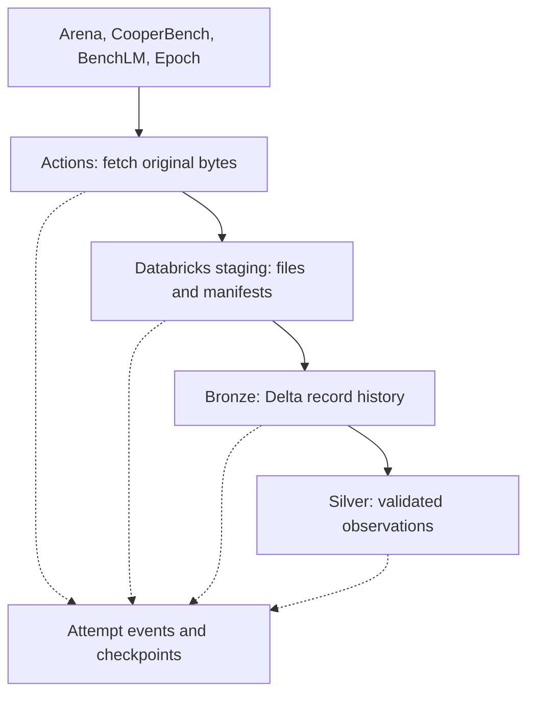

# GitHub Actions acquisition and Databricks processing

## Decision and status

The selected implementation runs source collection on GitHub Actions and all Spark processing on Databricks Free Edition. Source-call location differs from the original Databricks-only requirement. Instructor acceptance is pending. Technical acceptance and requirement acceptance must be reported separately. This pack is a design and implementation guide, not an executed pipeline.

## End-to-end route

The PC stores code and small reviewed samples only. No bulk raw-data folder, mandatory local Python environment or local Spark is required. Runner Python handles acquisition; managed Databricks Python/Spark handles extraction and processing. GitHub stores reviewed code/docs, not raw archive histories.

## Transfer contract

1. Task 02 proves a supported credential route from Actions to this specific Free Edition workspace. Prefer an available scoped supported route; do not assume service principals, OIDC federation or PAT creation are available. If none is available, STOP and report the exact missing capability. Do not request a token in chat, scripts or notebook cells.
2. Human sets approved secrets in GitHub repository/environment settings. Use DATABRICKS_HOST, a supported token/credential secret, and approved volume path variables. Confirm TLS host, workspace owner and privileges. Never enable billing.
3. Runner creates a STARTED attempt event in a restricted volume before source calls. If audit initialization or upload access fails, no collection proceeds. Retain run ID, triggering actor, commit SHA and approved source/batch parameters.
4. Stream unchanged source bytes into bounded runner temporary storage. Pin historical revisions. Preserve JSON/CSV/Parquet/tar.gz formats and record original byte counts, SHA-256, source revision and publication/observation bounds.
5. Upload files as raw bytes to a batch-specific volume path with overwrite disabled. Existing finalized file is reused only after verified hash match. An incomplete upload cannot be processed. Do not assume object rename is atomic.
6. Verify stored bytes using readback/checksum, not only PUT success or matching file length. Databricks also independently validates manifest hashes before consuming. Publish manifest and ready marker last; readers require a valid manifest and checksum match, not marker existence alone.
7. Trigger a Databricks job only if supported and verified, passing approved batch/manifest identifiers. Manual notebook launch is acceptable during readiness tests; unattended orchestration remains BLOCKED until job triggering is proven.
8. Delete ephemeral runner files at job completion; retain authoritative native history in Databricks. If upload fails, retry the exact pinned source; do not silently mark it ready or replace it with today's snapshot. Sources without retrievable history need an explicitly designed permitted backup before loss recovery can be claimed.

## Workflow security and cost

Start with workflow_dispatch only. Do not download baseline on every push or PR. Scheduling is enabled only in Task 10 after an explicit human dispatch/setting decision. Use minimum GitHub permissions (contents: read); no commit, write-back, token-derived Git identity or bot authors. Disable checkout credential persistence where used. Pin reviewed action versions to verified commit SHAs rather than inventing pins.

One collector per workspace staging namespace; use Actions concurrency and prevent simultaneous target writers. No pull_request_target or untrusted-fork workflow may access secrets. Workflow inputs select registered sources/modes, not arbitrary shell code or URLs. Avoid shell interpolation of untrusted values. Redact signed URLs, request headers, tokens and PII from logs.

Never upload raw traces, Epoch contact fields, archives or quarantine payloads as public Actions artifacts or releases. Only sanitized summary reports may become artifacts, with short reviewed retention. GitHub artifacts expire and are not the archival staging store. Inspect repository billing and runner/storage settings; use standard GitHub-hosted runners and remain within the observed free allowance. No paid larger runners, paid storage extension or automatic purchase.

## Operational units and replay

Track collection, upload/finalization, Staging-to-Bronze and Bronze-to-Silver independently. acquisition_started, acquired, uploaded, ready, bronze_committed and silver_committed are separate states. Upload success never implies transformation success. Use stable batch IDs and per-attempt IDs, target/contract/generation checkpoints and reconciliation of stale STARTED events. A hard kill may prevent terminal logging; recovery reconciles durable events with files and table history.

Bronze/Silver backfills read retained finalized manifests and do not require another download. Staging loss requires an exact-source Actions reacquisition, not a fictitious merged full snapshot. If both histories and unavailable source versions are lost, report irrecoverable gaps.

## References

- [Databricks Files API](https://docs.databricks.com/api/files/v2/file)
- [Volume REST operations](https://docs.databricks.com/aws/en/volumes/volume-files)
- [Trigger a job](https://docs.databricks.com/api/jobs/v2/run-now)
- [Free Edition limits](https://docs.databricks.com/aws/en/getting-started/free-edition-limitations)
- [Actions artifact retention](https://docs.github.com/en/actions/how-tos/manage-workflow-runs/remove-workflow-artifacts)
