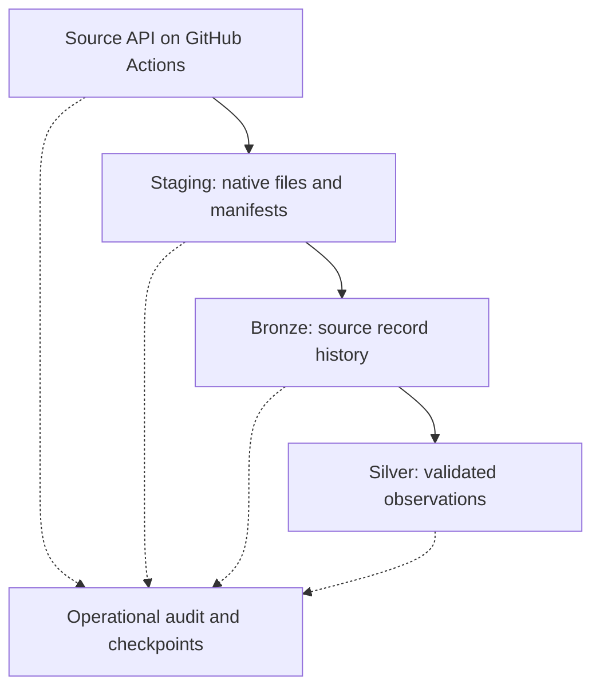

# Staging history, Bronze history and recovery

## Two separate histories

**Staging:** a restricted Unity Catalog volume stores original downloaded Parquet, JSON, CSV and tar.gz, unchanged, plus durable manifests. Each baseline/incremental source publication has a stable batch identity. A later download never overwrites an older baseline or increment. Identical content may be reused by an explicit manifest reference; preserve batch chronology and lineage even when bytes are deduplicated.

**Bronze:** managed Delta tables hold source record history with source/artifact/member identity, original batch/revision metadata, explicit contracts and load_timestamp. MERGE inserts missing provenance records; it does not repeatedly append the same artifact. Silver holds validated business observations and reviewed history/current-state models.



Proposed staging layout, using the actual approved volume root:

```text
<volume-root>/staging/<source-id>/<batch-id>/artifacts/<native-filename>
<volume-root>/staging/<source-id>/<batch-id>/manifest.json
<volume-root>/staging/<source-id>/<batch-id>/events/<attempt-id>.json
<volume-root>/working/<run-id>/
```

working is disposable derived preparation, not a third authoritative history. Keep originals and useful manifests. The exact safe file-publication method must be tested on the volume; do not assume all local filesystem rename semantics apply. Write temporary content, check bytes/hash, publish a complete manifest/ready marker last, and let readers consume only validated ready units. Never parse a half-download.

## Acquisition and processing records

Before a source request, initialize operational run/unit logging. Source-to-Staging records source URL/parameters, attempts, start/end, status and downloaded original bytes/hash. Rows inserted/updated are explicitly not applicable or zero under a documented file-acquisition convention; they are not claimed as Bronze row counts.

A finalized batch manifest contains batch_id, source_id, declared mode, revision/observation time, original files/checksums/bytes, source publication bounds when known, authoritative source ordering, acquired_at and complete/ready status. If source revision hashes have no ordering, retain verified publication chronology or accepted sequence; never sort hash strings as dates.

Use separate checkpoints per artifact AND target layer/table, contract version and recovery generation. Download success does not imply Bronze success; Bronze success does not imply Silver success. A successful old generation cannot cause a recreated table to skip necessary replay.

## Failures and recovery rules

| Failure | Recovery | Duplicate/history protection |
| :--- | :--- | :--- |
| Notebook/job stops mid-download | Ignore incomplete artifact; retry acquisition/upload of the same selected batch on Actions | No ready manifest until checksum/size verification; preserve failed attempt |
| Ready staging artifact exists but inventory update failed | Reconcile manifest and actual checksum before retrying inventory/processing | Artifact identity stays stable; no fabricated successful state |
| Bronze MERGE fails before commit | Retry affected artifact/unit | Delta commit boundary and deterministic provenance MERGE |
| Bronze commits, then logging fails | Inspect attributable target history, reconcile log and retry safely | No assumption of multi-table rollback; no duplicate insert |
| Bronze table actually lost/corrupted | Restore supported retained table version if possible; otherwise rebuild an isolated replacement from baseline + retained increments in source order | New recovery generation, contract checks, no broad blind append; validate before any approved replacement |
| Silver lost while Bronze survives | Replay selected Bronze history under contract and source authority order | Business-key MERGE and content-hash gates |
| Staging artifact lost while Bronze survives | Use Bronze for Silver; recover raw only by exact pinned source/revision through the Actions collector where still available | Do not call today's current snapshot the missing historical batch |
| Staging and Bronze history both lost | Recover supported backups or exact historical source revisions where available | Complete historical reconstruction may be impossible; report the gap rather than inventing increments |

A runtime crash normally interrupts work; it does not automatically destroy persisted Delta tables or raw files. Actual table/file loss is a different recovery test.

## Many increments after the baseline

Suppose F0 is the baseline and I1…In are retained source increments. Rebuild missing Bronze from F0, I1…In using their manifests and deterministic record identities. Do not replace them with one newly downloaded current snapshot and describe it as the original history. All replay attempts receive new run IDs but preserve source batch identities, observation times and publication dates.

Replaying a full historical file is safe when MERGE is correct; the label full is not the source of a primary-key conflict. Duplicate business rows arise from blind append, invalid keys, conflicting source duplicates or unsafe corrections. Validate key uniqueness before MERGE, quarantine unresolved conflicts, and prevent older accepted batches from downgrading newer state. Spark logical keys are not automatically enforced database primary keys.

If a newer full snapshot overlaps retained increments, explicit provenance identities may add Bronze observations for that artifact while Silver deduplicates compatible business observations. Do not confuse provenance row growth with business duplicates. Use a documented source-authority policy for corrections.

On genuine reconstruction, Bronze load_timestamp may reflect the rebuild time unless previous metadata is restored. Original source timestamps and keys remain stable. Existing Silver rows do not change merely because Bronze reconstruction timestamps differ; analytical hashes exclude processing metadata.

## Required recovery demonstrations

Run all destructive simulations only in isolated acceptance namespaces: incomplete staging file, log failure before/after ready publication, Bronze write interruption before/after commit, baseline plus multiple increment fixture replays, recreated Bronze generation, lost staging artifact and Silver replay. Synthetic fixtures are labeled test-only and do not count toward source-volume compliance. Retain sanitized actual PASS/FAIL/BLOCKED evidence. No zero-retention VACUUM, overwrite of accepted history or deletion of genuine raw files is part of a test.
